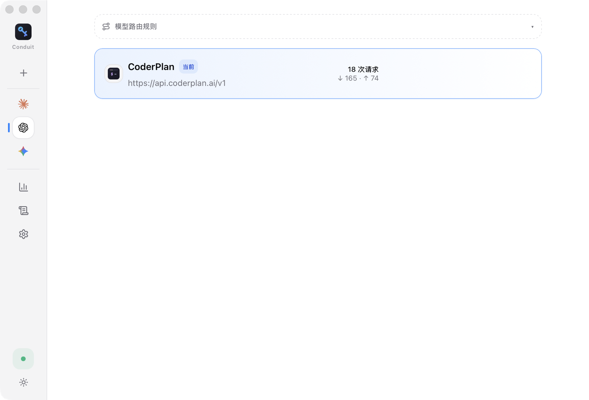
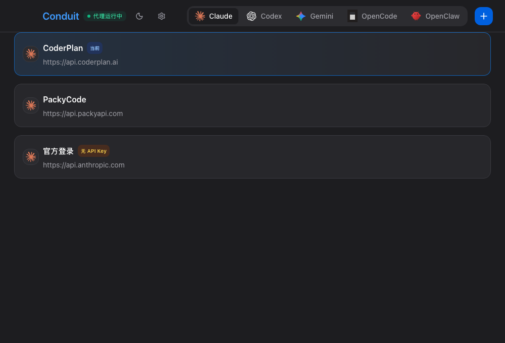

<div align="center">

# Keyway

### AI CLI 的本地供应中心

[](#)
[](https://tauri.app)
[](LICENSE)

一个应用管理 **Claude Code · Codex · Gemini CLI · OpenCode · OpenClaw** 的全部供应商。
切换即生效、免重启;API Key 加密存储、永不落盘明文。

[特性](#-核心特性) · [快速开始](#-快速开始)

|                  浅色                  |                  深色                  |
| :-----------------------------------: | :-----------------------------------: |
|  |  |

</div>

---

## ✨ 核心特性

- **⚡ 切换即生效,零重启** — 本地代理(`127.0.0.1:9527`)接管全部 CLI 流量,切换供应商只改一个指针,Codex / Gemini 与 Claude 一致免重启
- **🔐 Key 永不落盘明文** — API Key 存系统钥匙串(macOS Keychain / Windows DPAPI / Linux Secret Service),配置库整库 SQLCipher 加密
- **🛰️ 代理优先架构** — 代理是默认体验而非高级选项;关闭窗口驻留托盘,CLI 永不断流
- **📊 转发即计量** — 代理转发同时原生统计各供应商 token 用量,零额外请求
- **🌗 浅色 / 深色 / 跟随系统** 三态主题,`⌘N` 新建、`⌘1..5` 快速切换应用

## 📦 安装

从 [Releases](https://github.com/anmutu/keyway/releases/latest) 下载对应平台安装包。

> **macOS 首次打开**:安装包未做 Apple 公证(个人开源项目),双击若提示「无法验证开发者」——在 Finder 里**右键点 Keyway.app → 打开 → 再点「打开」**即可,仅首次需要。
> **Windows**:SmartScreen 提示时选「仍要运行」。

## 🚀 快速开始

```bash
pnpm install
pnpm tauri dev     # 开发(首次会请求钥匙串授权)
pnpm tauri build   # 构建
```

环境要求:Node 18+ / pnpm / Rust 1.85+ / Xcode CLT(macOS)。

## 📖 使用文档

| 文档 | 内容 |
|---|---|
| [产品说明](docs/guide/README.md) | 解决什么问题 / 核心特点 / 5 分钟上手 / FAQ |
| [Claude Code 指南](docs/guide/claude-code.md) | 接管、切换、官方订阅共存 |
| [Codex 指南](docs/guide/codex.md) | 完整故障排查 |
| [Gemini CLI 指南](docs/guide/gemini.md) | Gemini 格式供应商接入 |
| [GLM 接入](docs/guide/providers/glm.md) / [Kimi 接入](docs/guide/providers/kimi.md) / [CoderPlan 接入](docs/guide/providers/coderplan.md) | Anthropic 兼容端点接法 |

## 🗺️ 路线图

- **M1**:takeover 接管(自动改写各 CLI live 配置)+ 首启导入 + 故障转移/熔断
- **M2**:成本归因(项目/会话/模型)+ MCP/Skills 管理 + 云同步
- **M3**:团队配置共享

详见 [docs/design.md](docs/design.md)。

## License

MIT
